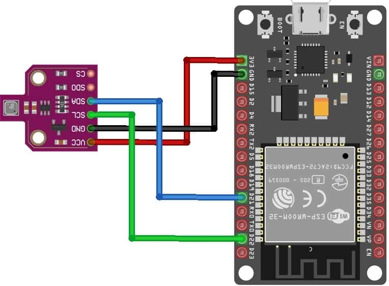

---
authors:
- admin
categories:
- IoT
date: "2025-03-02T00:00:00Z"
draft: true
featured: false
lastmod: "2025-03-02T11:56:00Z"
projects: []
subtitle: "A Personal IoT Project"
summary: "This is a review of a personal project where i use AI to constrauct an IoT-based temperature and air quality monitoring system with a basic knowledge of electronics, C programming, and web development. Using an ESP32 and a Bosch BME680 sensor, data is logged and displayed in a dashboard powered by Google Sheets and JavaScript wich i fully programmed and designed."
tags:
- ESP32
- IoT
- Python
- Data Logging
- Google Sheets
- JavaScript
- Sensor Data
- Air Quality

title: Temperature and Air Quality Monitoring with ESP32

reading_time: true 

share: false

image:
  caption: ""
  focal_point: ""
  preview_only: false
---

## Introduction

This project was entirely developed using AI (Specifically Chat-GPT) alongside a basic knowledge of electronics, C programming, and web development. 
I fully designed the dashboard and then hosted it on GitHub, this displays real-time environmental parameters from my apartment, measured with an **ESP32 board** and a **Bosch BME680 sensor**. Measurements are recorded every minute and stored in a Google Spreadsheet, which feeds into this website to visualize the data.

## The Sensor: BME680

**Sensing Capabilities**: Measures ambient temperature (−40 to +85°C, ±1.0°C accuracy), relative humidity (0–100% RH, ±3% accuracy), and pressure (300–1100 hPa, ±1 hPa absolute accuracy). In addition, it contains a MOX gas sensor that detects volatile organic compounds (VOCs) and outputs a resistance value used for air quality estimation.
The gas sensor responds to a broad range of indoor air pollutants (excluding CO₂) by changing its resistance — higher VOC levels cause its resistance to drop, and lower VOC levels cause the resistance to rise (The raw gas resistance is later converted to an IAQ index by the BSEC library, since the BME680 itself does not compute IAQ internally.

**Digital Interface**: Supports both I²C (2-wire) and SPI (3-wire or 4-wire) communication. The I²C interface can operate up to 3.4 MHz, and the SPI interface up to 10 MHz. This flexibility makes it easy to interface with microcontrollers like the ESP32. The sensor has two I²C address options (0x76 or 0x77) selectable by the logic level on the SDO pin. On many breakout boards, the default I²C address is either 0x76 (SDO tied to GND) or 0x77 (SDO tied to VCC) – you can change it by wiring SDO to the opposite logic level.

**Power Requirements**: The BME680’s main supply (VDD) can range from 1.71 V to 3.6 V, and the I/O interface (VDDIO) supports 1.2 V to 3.6 V logic. This means it can run at 3.3 V directly, which is ideal for the 3.3 V ESP32. (Many breakout modules include a voltage regulator and level shifters, allowing 5 V usage as well, but when connecting to an ESP32 you can simply use 3.3 V for both.) The sensor is power-efficient for reading temperature, humidity, and pressure (on the order of 2–3 µA for 1 Hz sampling of those parameters), but the gas sensor heater can draw between 0.09 mA and 12 mA depending on the mode.
The BME680 features several power modes, including a sleep mode (~0.15 µA) when not taking measurements.

**Gas Sensor for IAQ**: The BME680’s gas sensor is a metal-oxide (MOX) gas detector that heats an internal substrate to ~200–400 °C and measures the resistance changes caused by gas adsorption. It provides a qualitative measurement of total VOC content in the air (it cannot distinguish specific gases). Important: MOX sensors require initial burn-in and calibration. When first used, the BME680 should run for a few hours (per Bosch, ~24–48 hours) to stabilize the readings, and for a few minutes each time it’s powered on before readings are fully reliable.

We will rely on Bosch’s BSEC (Bosch Software Environmental Cluster) library to convert the raw gas resistance into an IAQ index (air quality score) and equivalent estimates (eCO₂ and bVOC), which greatly simplifies using the BME680 for air quality monitoring.

<figure>
  
  <figcaption>Figure 1: BME680 Sensor</figcaption>
</figure>

#### Temperature
- **Range:** -40°C to +85°C
- **Precision:** ±0.5°C (0°C to +65°C)
- **Resolution:** 0.01°C

#### Humidity
- **Range:** 0% to 100% RH (non-condensing)
- **Precision:** ±3%
- **Resolution:** 0.008%

#### Pressure
- **Range:** 300 hPa to 1100 hPa
- **Precision:** ±1.0 hPa
- **Resolution:** 0.2 Pa

## Arduino Integration

Connecting the BME680 to an ESP32 is straightforward, as both devices use compatible logic levels (3.3 V). You can choose to use either the I²C interface (requiring only two data lines) or the SPI interface (requiring four data lines) depending on your needs. I²C is simpler and uses fewer pins, while SPI can offer faster data rates if needed. Below are wiring diagrams and instructions for each interface. Be sure to power the sensor with 3.3 V and connect all grounds common together. If you’re using a breakout board, double-check its pin labels (VCC, GND, SCL, SDA, SDO, CS) and any jumper settings for interface selection.

<figure>
  
  <figcaption>Figure 3: ESP32 connected to BME680</figcaption>
</figure>

The **Arduino code**, available on my [GitHub repository](https://github.com/GarauGarau/TempData/blob/main/besc_script/besc_script.ino), integrates **BSEC libraries** for calibrated sensor readings. It also computes an **Indoor Air Quality (IAQ) index** based on gas readings.

## Backend Architecture

The system architecture follows a simple yet effective pipeline:

### Data Collection
The system follows a streamlined IoT pipeline that efficiently collects, transmits, and visualizes sensor data. It eliminates the need for a dedicated backend server, leveraging Google Sheets as a database.

### Data Transmission
Once collected, the data is sent via HTTP POST requests to a *Google Apps Script** endpoint, which writes the values into a Google Spreadsheet.

### Data Storage
The Google Spreadsheet acts as a database, eliminating the need for complex backend infrastructure.

### Data Retrieval and Visualization
JavaScript retrieves data from the spreadsheet and displays it in real-time charts.

## Frontend Dashboard

The dashboard consists of:
- **Summary Page:** Displays real-time sensor readings.
- **Charts Pages:** Dedicated views for temperature, humidity, pressure, and air quality trends.

