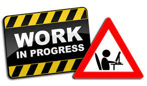

---
authors:
- admin
categories:
- Tutorial
date: "2022-10-23T15:21:54+05:30"
draft: false
featured: false
lastmod: "2022-10-23T15:21:54+05:30"
projects: []
subtitle: "Primi passi e template funzionanti"
summary: "Quali sono le ragioni che rendono LaTex il linguaggio tipografico più utilizzato in ambito accademico? Una breve guida sui vantaggi che potrai sperimentare durante il suo utilizzo, i primi passi da compiere e alcuni template da riutilizzare nei tuoi progetti."
tags:
- LaTex
- Tutorial
- Template LaTex
title: Come iniziare ad usare LaTex
reading_time: true 
share: false
image:
  caption: ""
  focal_point: ""
  preview_only: true
---

# Un pò di storia

