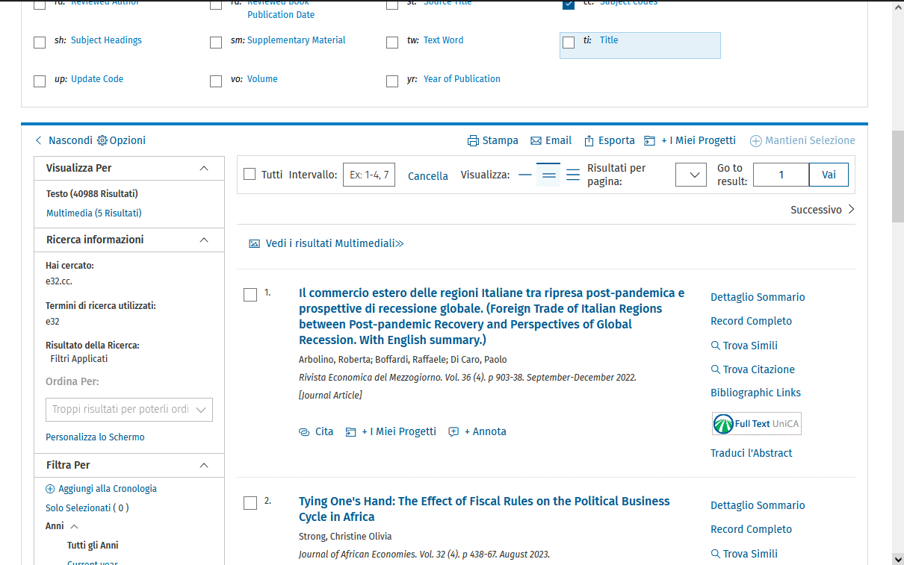

---
authors:
- admin
categories:
- Tutorial
date: "2023-10-11T00:00:00Z"
draft: false
featured: false
lastmod: "2023-10-11T11:56:00Z"
projects: []
subtitle: "A Real-Life Use Case"
summary: ""
tags:
- Python
- Repetitive Tasks
- PyAutoGui
- Automating Repetitive Tasks
- GUI Automation
- PyAutoGui practical use case

title: Automating Repetitive Tasks Using PyAutoGUI

reading_time: true 

share: false

image:
  caption: ""
  focal_point: ""
  preview_only: false
---



## Introduction

Automation is an indispensable tool when dealing with repetitive and time-consuming tasks. In this article, we’ll explore a real-life scenario in which Python, combined with the PyAutoGUI library, significantly simplifies a cumbersome data extraction process from EconLit.

## Context

I had the hefty task of downloading over 40,000 articles from [EconLit](https://www.aeaweb.org/econlit/), a bibliographic database. However, the task was not straightforward due to the limitations set by the EconLit platform itself. There was no feature for mass exportation, which meant I couldn’t simply select all search results and download them in one go.

<figure>
  
  <figcaption><a name="fig1">Figure 1</a>: The task to automate.</figcaption>
</figure>

This limitation compelled users to undertake the tedious process of manually exporting 200 articles at a time. The interface allowed me to select and download articles in batches, with each batch comprising a maximum of 200 articles. For instance, I had to select and download articles numbered 1-200 in the first batch, then proceed with the next set, numbered 201-401, and continue this manual, iterative process. This meant that for 40,000 articles, I would have to repeat this process 200 times!

But manual processes are notoriously prone to human errors. Every selection, click, and naming action opened up possibilities for mistakes. Perhaps I might skip a batch, select the wrong range of articles, or even name the files inconsistently, leading to confusion and disorder in the dataset. Such mistakes were not just hypothetical; given the monotonous and repetitive nature of the task, they were almost inevitable.

Additionally, there was the challenge of saving and naming each file. Each batch of articles had to be saved with a distinct name that reflected its contents, facilitating easier retrieval and organization later. Manual naming is not only time-consuming but also inconsistent, as fatigue and monotony set in.

In a nutshell, doing this task manually was not just mind-numbingly tedious but also fraught with the risk of human errors, inconsistencies in file naming, and potential data loss or corruption. Automation was not just a convenience; it was a necessity to ensure accuracy, consistency, and efficiency in completing this monumental task.

## The Solution

To expedite this process, I crafted a Python script utilizing the PyAutoGUI library. 

[PyAutoGUI](https://pyautogui.readthedocs.io/) is a Python module that provides functions to programmatically control the mouse and keyboard. In other words, it allows your code to virtually take control of your mouse and keyboard to perform tasks that you would normally do manually. This is especially handy for automating repetitive GUI (Graphical User Interface) interactions, like the task of downloading multiple files from a website that I previously described. PyAutoGUI works on Windows, macOS, and Linux. With simple commands like `pyautogui.click()`, `pyautogui.move()`, `pyautogui.write()`, and others, you can emulate mouse clicks, movements, and keyboard strokes.

### Script Explanation

Below is a brief walkthrough of the script’s structure and functionality.
Initially, the script invites the user to identify crucial positions on screen locations. Think of this step as calibrating the tool for the task ahead, providing it with the 'coordinates' it will need to navigate the downloading process on your behalf. The positions of the input box, export location, export button, save bar, and save button are all recorded, each corresponding to a particular coordinate in the screen.

<figure>
  
  <figcaption><a name="fig2">Figure 2</a>: The script at work.</figcaption>
</figure>

Following this setup, the script transitions into its primary function: the automated download sequence. This part of the script acts as a virtual operator, conducting the series of actions you'd usually perform manually. It inputs the article range, navigates through the export process using the predetermined coordinates, and saves each file with a unique name.

Finally, the script enters a loop, repeating the download sequence for each set of articles from 1 to 40,000. In the looping structure, the script automates the repetitive and time-consuming task of downloading and saving batches of articles. It works tirelessly, moving from one batch to another with accuracy and efficiency.

```python
import pyautogui
import time

positions = {}

def get_position(prompt):
    input(prompt)
    position = pyautogui.position()
    print(f"Mouse position is: {position}")
    return position

# Get positions manually
positions["input_box"] = get_position("Move mouse to the input box and press Enter...")
positions["move_to_1"] = get_position("Move mouse to the Export location and press Enter...")
positions["move_to_2"] = get_position("Move mouse to the Export button and press Enter...")
positions["move_to_3"] = get_position("Move mouse to the save bar location and press Enter...")
positions["file_save"] = get_position("Move mouse to the save button and press Enter...")

def automate_sequence(start, end, save_name):
    pyautogui.click(*positions["input_box"])

    pyautogui.hotkey('ctrl', 'a')
    pyautogui.press('backspace')

    pyautogui.write(f'{start}-{end}')

    pyautogui.PAUSE = 1
    pyautogui.moveTo(*positions["move_to_1"])
    pyautogui.click()

    pyautogui.PAUSE = 1
    pyautogui.moveTo(*positions["move_to_2"])
    pyautogui.click()

    pyautogui.PAUSE = 1
    pyautogui.moveTo(*positions["move_to_3"])
    pyautogui.click()

    pyautogui.hotkey('ctrl', 'a')
    pyautogui.press('backspace')
    pyautogui.write(str(save_name))

    pyautogui.moveTo(*positions["file_save"])
    pyautogui.click()


input("Press Enter after you've navigated to the desired website and are ready to automate...")

save_name = 1

for i in range(1, 41001, 200):
    start = i
    end = i + 199
    automate_sequence(start, end, save_name)
    save_name += 1

    time.sleep(1)

```

- **Initialization**: Import necessary libraries and initialize a dictionary to store positions.

- **Position Capturing**: The get_position function is used to manually capture and store essential coordinates on the screen. It assists the script in locating where to click and type during the automation process.

- **Task Automatio**n: The automate_sequence function performs the core automation tasks. It clicks on specific positions, types the article range, and navigates through the GUI to initiate the export process.

- **Looping Through Pages**: A for-loop iterates through the desired range of articles, calling the automate_sequence function for each batch of articles. The loop increments the file's save name after each iteration.

## Conclusions and final remarks 

Python, with the PyAutoGUI library, offers a powerful and accessible solution for automating repetitive GUI tasks. In my case, it greatly facilitated the mass exportation of articles from EconLit, turning a tedious manual operation into a smooth, automated process. Whether for data extraction or other repetitive tasks, consider leveraging Python's automation capabilities to save time and reduce error in your projects.

To conclude, however, I would like to do an observation, in this post I’ve showcased an automation solution meticulously crafted to navigate through a daunting, repetitive process seamlessly. But, heed this: *automation is not a one-size-fits-all remedy for every challenging task thrown our way.*

As we've noted, there are instances where the time and energy invested in creating an automation setup could outweigh the benefits, especially for tasks that are in the *one and done* category. Can you imagine spending precious hours, or even days, devising an elaborate automated system for a task that you will only execute once?

Therefore, before diving headfirst into automation, take a moment to weigh your options. Consider the complexity of the task at hand, the time required to develop and test the automation, and the frequency of the task's recurrence. Sometimes, the old-fashioned, manual way of doing things is not only sensible but also more efficient for one-time tasks.

