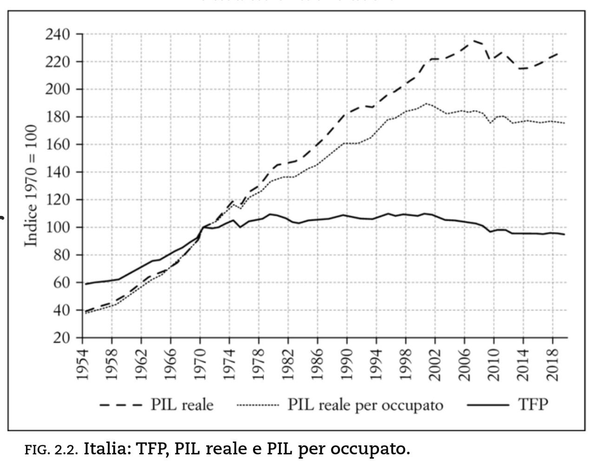

---

# Testi esercitazioni

-  Esercitazione 1

# Soluzioni

-  Soluzione esercitazione 1 

# Approfondimenti e risorse utili

## Dati e siti Web
- [Canale Telegram Istat Comunicati stampa](https://t.me/istatstampa)
- [Sito OECD](https://www.oecd.org/)
- [World Bank](https://www.worldbank.org/en/home)
- [Lavoce.info](https://www.lavoce.info/)

## Articoli
- [Why is inflation so high and will it stay that way? An economist explains](https://www.weforum.org/agenda/2022/05/inflation-rising-economist-explains/?utm_source=pocket_mylist)

- [The Unequal Effect of Interest Rates by Race, Gender](https://www.frbsf.org/economic-research/publications/economic-letter/2022/august/unequal-effect-interest-rates-by-race-and-gender/?utm_source=pocket_mylist)

- [How Much Do Supply and Demand Drive Inflation?](https://www.frbsf.org/economic-research/publications/economic-letter/2022/june/how-much-do-supply-and-demand-drive-inflation/?utm_source=pocket_mylist)

 